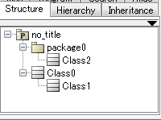
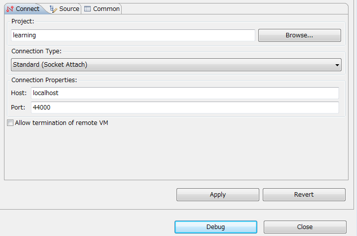

.. クラスの総数を表示するプラグインを作ってみましょう

Let's make a Plug-in to count number of Classes in Astah
=========================================================

.. 単純なプラグインを作成しました。そのプラグインをベースに実践的なプラグインを作成してみましょう。設計されたモデルの品質を評価する指標の一つに、クラスの総数を利用することがあります。Hello Worldの代わりに、astah*モデル内のクラスの総数を表示するプラグインを変更してみましょう。

We've created a simple Astah Plug-in. Now let's make another one. This time make one to count number of Classes in Astah which can be used as one of indexes for an evaluation of the value of designs.

.. astah*モデル内のクラスの総数とは、下記のastah*モデルの場合は、3つです。

In this sample model as the figure below, there are three classes in this model.

.. プラグインによって追加したメニューを押下すると､ ::

Now let's make a Plug-in to count the models and let it show the number as below. ::

  "There are 3 classes"

.. と表示されるようにしてみましょう。

.. 英語版では上の文省きました。（一つ前の文にまとめました）

.. モデル情報を取得してみましょう

Getting model information
-------------------------------------------------------

.. astah*のモデル情報を取得するために、astah* APIを活用してみましょう。astah* APIとは、astah*のモデルデータを活用するアプリケーションを開発するためのJavaインターフェース群です。astah* APIの詳細については、本体に付属するastah* API利用ガイドを参照してください。

In order to get model information, let's use Astah API. Astah API is a group of Java interfaces for reading/writing Astah which can be used to count number of classes in this case. Please refer to `Astah API User guide <http://members.change-vision.com/javadoc/astah-api/8_2_0/api/en/doc/index.html>` _ for details about Astah API.

.. これから書くコードでは、ProjectAccessorから現在開いているastah*モデルのルートモデルを取得し、再帰的にすべてのクラスを取得します。それではクラスの総数をメッセージダイアログに表示するようにHelloWorldプラグインを修正してみましょう。

We are going to write a code to get the root model of Astah by using ProjectAccessor and get all the classes under the root model recursively. Now let's modify the "Hello World" Plug-in to make it show the number of Class in the menu instead.

.. まず、CountClassActionクラスを作成しましょう。

First, create CountClassAction class.

.. literalinclude:: _snippets/CountClassAction.java
   :language: java
   :linenos:

.. 次に､plugin.xmlファイルにCountClassActionクラスを使ったメニューに変更しましょう。

Now, modify the plugin.xml with this CountClassAction class.

.. literalinclude:: _snippets/plugin_count_class_action.xml
   :language: xml
   :linenos:

.. 最後に､plugin.propertiesに追加したメニューのラベルを追加します｡ ::

At last, add the label for this menu in plugin.properties ::

 count_classes=Count classes(C)

.. これで､クラスの数をカウント結果を表示できます。
  
And now this new Plug-in should show number of classes in Astah from the menu.

.. デバッグしてみましょう

Debugging the Plug-in
------------------------------------------------------------

.. ネストクラスのクラス1とパッケージ0以下のクラス2を、再帰的に取得できるかデバッグしながら、確認してみましょう。デバッグをするには次のコマンドを実行します。 ::

Now let's debug and also see if it can get a nested class1 and class2 under a pacage0 recursively by running the command below. ::

 > astah-debug
 
..
  すると、44000ポートがリモートデバッグ用のポートとして開かれた状態で起動します。IDEなどからこのポートに接続し、リモートデバッグします。

This command launches Astah with the 44000 port open for remote debugging which you can connect from IDE.

.. Eclipseを使ったリモートデバッグの例

Example of remote debugging using Eclipse
^^^^^^^^^^^^^^^^^^^^^^^^^^^^^^^^^^^^^^^^^^^^^^^^^^^^^^^^^^^^

.. Eclipseの場合は、下記のように設定します。

If you are using Eclipse, please make the configuration as below.

.. 設定後､Debugボタンを押すとリモートデバッグが開始されます。適当な場所にブレークポイントを設定し､実行すると、デバッグが行われます。なお、リモートデバッグの詳細については、本書で扱う範囲外のため、割愛します。

Clicking [Debug] button executes the remote debugging. Please set a breakpoint in the line of codes if you like. This is all we provide regarding the remote debugging on this tutorial.