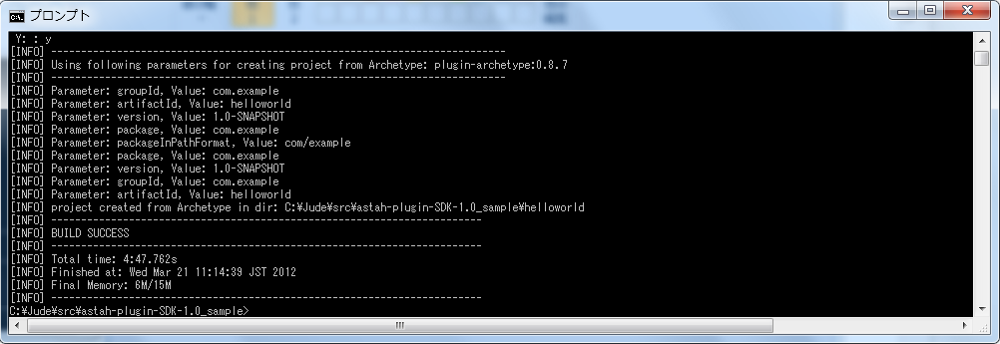

.. Hello Worldプラグインを作ってみましょう

Let's make a sample Plug-in, "Hello World"
=======================================================

.. 本章ではメニューの追加を例に、astah*のプラグイン開発を紹介します。

This section will introduce you how to make a Plug-in that adds a menu to Astah.

.. プラグインプロジェクトの新規作成

Creating a new project
-------------------------------------------------------

.. まず、プラグインプロジェクトを新規作成します。プラグインプロジェクトを作成したいディレクトリへ移動し、次のコマンドを入力しましょう。 ::

First, create a new project. Move to the directory where you want to create a Plug-in Project and then run the command below. ::

 > astah-generate-project

.. astah* SysMLのプラグインプロジェクトを新規作成するには、次のコマンドを入力しましょう。 ::

If you are using Astah SysML ::

 > astah-sysml-generate-project
 
.. 続いてgroupId、artifactId、version、パッケージを指定してください。

Next, specify the group id, artifact id, version and etc.

==================== ============================================================
 Parameter            Description
==================== ============================================================
groupId               Specify the distinguished name of the project. In general, the name is the root package name of your project.
artifactId            Specify a project name used for generated folder names and jar file names.
version               Specify the version of the project.
package               Specify the package name of the project. The package name is the same as groupId or the name of nested package.
==================== ============================================================

.. figure:: images/astah-generate-project.png
   :width: 640
   :alt: Generate Plug-in Project

.. エラーがなければ、指定したartifact idと同名のフォルダがプラグインプロジェクトとして作成されます。

A new folder for the Plug-in project will be generated in a name you specified in the artifact id.

.. 生成されたプロジェクトの内容を簡単に説明します。

Generated project consists of the files below.

==================== ============================================================
 File Name            Description
==================== ============================================================
pom.xml               This includes maven setting such as project build information and 
                      dependencies.
Activator.java        This describes the initialization and finalization for Astah Plug-in and will be called when the
                      Plug-in is started or stopped.
plugin.xml            Describe extension point ex. menu, view etc.
                      This chapter uses menu extension point of Astah, details will be explained below.
plugin.properties     Internationalize labels to show UI on Astah
plugin_jp.properties  plugin.properties will be used as default.
                      However if you'd like to write in Japanese, 
                      use plugin_jp.properties.
==================== ============================================================

.. 開発中のプラグインを読み込んだ状態でastah*を起動しましょう

Launching Astah with the Plug-in in development
----------------------------------------------------------

.. 開発中のプラグインを読み込むには、まずビルドしなければなりません。そのために、作成したプラグインプロジェクトのディレクトリへ移動し､次のコマンドを実行してみましょう。 ::

Try launching Astah with the Plug-in in development. First, you need to build the project. To do so, move to the directly of the Plug-in project and then run the command below. ::

 > astah-build
 
.. figure:: images/astah-build-success.png
   :width: 640
   :alt: Success of build astah* plug-in project
   
.. ビルドが成功すると、targetフォルダが作成され､その中に[artifact id]-[version].jarというファイルが作成されています｡このファイルがプラグインファイルです｡続いて、このプラグインファイルを読み込んでastah*を起動します。次のコマンドを実行してみましょう。 ::

After its being built successfully, a new folder "target" is created which includes [artifact id]-[version].jar file. This is a Plug-in file. Now let's launch Astah with this Plug-in by running the command below. ::

 > astah-launch

.. すると、プラグインが読み込まれた状態でastah*が起動します。

Astah should launch with this Plug-in.

.. figure:: images/astah-launch-success.png
   :width: 571
   :alt: astah*プラグインプロジェクトを組み込んでastahの起動に成功

..  [ヘルプ]-[プラグイン一覧]メニューを見ると､次のようにテンプレートのプラグインが読み込まれていることを確認できます。

You can see this Plug-in in the list from [Help] - [Plugin List] menu.

.. また、[ツール]メニューを開くと、下のほうにメニューが追加されています。

Also you will see a menu that is added by this Plug-in under [Tool] menu.

.. IDEにプラグインプロジェクトをインポートしましょう

Importing Plug-in project to IDE
----------------------------------------------------------

..  astah* Plug-in SDKはMavenベースのツールです。しかし、実際にプラグインの開発では、astah* Plug-in SDKのみを用いて開発を進めるというよりも、EclipseやIntelliJ IDEAなど、IDEと連携して開発する場合がほとんどでしょう。

Astah Plug-in SDK is based on Maven, however you would like to use IDE like Eclipse [#eclipse1]_ or IntelliJ IDEA [#IntelliJ]_ to develop Plug-ins instead of using Astah's Plug-in SDK only.
 
..  ここでは、EclipseとIntelliJへのプラグインプロジェクトのインポート方法を解説します。お使いのIDEにインポートしてみましょう。

So we will show you how to import the Plug-in project to Eclipse and IntelliJ.

Eclipse
^^^^^^^^^^
.. EclipseとMavenを連携させるm2eをインストールしておくと、Eclipse上からMavenのコマンドを実行できます｡

You can run maven commands in Eclipse by using m2e.

.. m2eを使っても、astah*プラグインの作成で必要なJARへのクラスパスの設定がうまく行きません。ここではm2eのDependency Managementを用いずに、クラスパスの設定にはastah-mvnコマンドを使います｡

.. warning::
  
  However you are not able to set the classpath to JAR while using m2e. So to set the classpath, you need to use astah-mvn command instead of using m2e’s Dependency Management.

.. Eclipseとm2eのインストール

Installation of Eclipse and m2e
~~~~~~~~~~~~~~~~~~~~~~~~~~~~~~~

.. まず、Eclipseとm2eをインストールします。 `Eclipseのサイト <http://eclipse.org/downloads/>`_ より、 ::

First, install Eclipse and m2e from `Eclipse <http://eclipse.org/downloads/>`_. This package includes m2e. ::

  Eclipse IDE for Java Developers

.. をダウンロードしてください。このパッケージにはm2eが同梱されています。

.. Eclipseはパッケージを解凍するだけでインストールが済み､また既存の開発環境に影響を与えません。本チュートリアルの実施では、こちらのパッケージをお勧めします｡もちろん既存の環境にm2eをインストールしてもastah*プラグイン開発を行えます｡既存の環境にm2eをインストールする場合は、`m2eのサイト <http://eclipse.org/m2e/>`_ を参考にしてく
.. note::

  Installation of this package should not effect to anything on your development environment. Therefore we recommend you to use this package. However if you have Eclipse installed already, you can install m2e from `m2e <http://eclipse.org/m2e/>`_.

.. astah* Plug-in SDKをEclipseのMAVEN_HOMEとして設定する

Configuration of Astah Plug-in to MAVEN_HOME on Eclipse
~~~~~~~~~~~~~~~~~~~~~~~~~~~~~~~~~~~~~~~~~~~~~~~~~~~~~~~~

.. Eclipseを起動し、ワークスペースを選択後、astah* Plug-in SDKをMAVEN_HOMEに設定します。

Run Eclipse and then choose workspace and set "Astah Plug-in SDK" to MAVEN_HOME.

.. [Window]-[Preferences]を開き､[Maven]-[Installations]ページを開きます。そして次の図のようにInstallationsに、astah* Plug-in SDKのインストールフォルダ(ASDK_HOME)を追加してください。

Open Eclipse Preference from [Window] - [Preferences] and then select [Maven] - [Installations]. Add Astah Plug-in SDK's installation directory (ASDK_HOME) as the figure below.

.. これでEclipse上に読み込む準備ができたので、Eclipseのプロジェクトとしてインポートしてください。

Now all is ready. Import the Plug-in project into Eclipse.

IntelliJ IDEA
^^^^^^^^^^^^^^^^^^^^^^^^^^^^^^^^^^^^^^^^^^^^^^^^^^^^^^^^^^

.. IntelliJ IDEAには標準でMavenとの連携機能が組み込まれています｡ `IntelliJのサイト <http://www.jetbrains.com/idea/>`_ より、ダウンロードしてください。

IntelliJ IDEA has Maven Integration. Please download IntelliJ IDEA from `IntelliJ site <http://www.jetbrains.com/idea/>`_.

.. 初めて起動した場合はまずプロジェクトの新規作成のウィザードが立ち上がります。既にお使いの場合は､次の「astah* Plug-in SDKをIntelliJ IDEAのMAVEN_HOMEとして設定する」を行ってからプロジェクトのインポートを行ってください｡

When you first run IntelliJ IDEA, a [New Project Wizard] appears for the set up. If you have used IntelliJ IDEA already, please read  :ref:`set_MAVEN_HOME_to_IntelliJ` and then import the project.

.. 生成したプラグインプロジェクトをIntelliJ IDEAにインポートする

Importing a Plug-in project to IntelliJ IDEA
~~~~~~~~~~~~~~~~~~~~~~~~~~~~~~~~~~~~~~~~~~~~~~~~~~~~~~~~~~~~~~

.. 生成したプラグインプロジェクトをインポートしましょう。通常の手順と同様のため、割愛します。

Please refer to IntelliJ's resource for how to import projects. However you need to set the Astah Plug-in SDK on IntelliJ before you import the Plug-in project.

.. astah* Plug-in SDKをIntelliJ IDEAのMAVEN_HOMEとして設定しましょう

.. _set_MAVEN_HOME_to_IntelliJ:

Configuation MAVEN_HOME to Astah Plug-in on IntelliJ IDEA 
~~~~~~~~~~~~~~~~~~~~~~~~~~~~~~~~~~~~~~~~~~~~~~~~~~~~~~~~~~~~

.. astah* Plug-in SDKをIntelliJ IDEAのMAVEN_HOMEとして設定しましょう｡

Let's set Astah Plug-in SDK to MAVEN_HOME in IntelliJ IDEA.

.. IntelliJを起動後、[File]-[Settings]を開き､[Maven]ページを開きます｡そして、次の図のように、Maven home directoryのOverrideにチェックし、astah* Plug-in SDKのインストールフォルダ(ASDK_HOME)を指定してください。

Run IntelliJ, and then select [File] - [Settings] - [Maven]. Check the [Override] for Maven home directory and then specify Astah Plug-in SDK install folder(ASDK_HOME) as figure below.

.. figure:: images/IntelliJ_settings.png
   :width: 573
   :alt: IntelliJ IDEA Settings Page

.. 設定が終わると､クラスパスが設定されます。

When the setting is completed, the classpath should have been set up.

.. メッセージを表示するメニューを作成しましょう

Adding menus on Astah
-------------------------------------------------------------

.. astah*のプラグインを作成するには、astah*が提供する拡張ポイントの内容を<extension>タグのpoint属性でplugin.xmlに記述する必要があります。現時点で提供している拡張ポイントは以下の2つです。

To create a Plug-in for Astah, an extension point needs to be defined in plugin.xml with the "point" property of <extension> tag. Currently following two extension points are provided.

====================================== ======================================
 Extension Point Name                   Description
====================================== ======================================
com.change_vision.astah.ui.actionSets   Adding a menu on Astah
com.change_vision.astah.ui.view         Adding an extended view on Astah
====================================== ======================================

.. これから追加するのは、メニューです。下記はメニューを追加するplugin.xmlの例です。

Below is a sample of how you write plugin.xml to add a menu on Astah.

.. literalinclude:: _snippets/plugin_menu.xml
   :language: xml
   :linenos:

.. この例では<menu>タグを追加し 、[ツール]メニューに[サンプルメニュー]を追加しています。<action>タグでは、[サンプルメニュー]にHello Worldプラグインのメニューを追加しています。メニューを追加する位置は、<action>タグのmenubarpath属性で指定します。toolは[ツール]メニューのidで、<menu>タグのpath属性と<action>のmenubarpath属性に各メニューのidを記述する必要があります。各メニューのidは :doc:`appendixA` を参照してください。<actionSet>タグは各<action>タグをグループ化します。<action>タグのclass属性で、メニューが押されたときに呼ばれるアクションを定義します。

In this sample, <menu> tag is used to add a new menu [Sample Menu] under [Tool]. <action> tag is used to add another menu with Hello World Plug-in under the [Sample Menu]. The location of menu is specified with <action> tag's menubarpath attribute. The value "tool" is an id of [Tool] menu and it should be specified in the <menu> tag's path attribute and also <action> tag's menubarpath attribute. The id of all the menu can be found at :doc:`appendixA`. Also <actionSet> tag is used to group all the <action>tags. All the actions when the menu is selected should be specified with <action>'s class attributes.

.. まとめると下記のようになります。

Here is the summary for the plugin.xml.

=================== =========== ======== =============================================
Tag Name             Attribute  Required   Description                               
=================== =========== ======== =============================================
plugin              \            o       \                                           
extension           \            o       Specify extension point                   
\                   point        o       Specify com.change_vision.astah.ui.actionSets
actionSet           \            o       Specify the group of menu to menubar
\                   label        \       (Reserved word)                              
\                   visible      \       (Reserved word)                              
\                   id           \       Specify group ID 
menu                \            \       Add menu group              
\                   label        o       Specify label of group menu
\                   id           o       Specify id of group menu          
\                   path         o       Specify location of path                 
action              \            \       Add menu                      
\                   label        o       Specify label of menu               
\                   icon         \       (Reserved word)                              
\                   class        o       Specify the class of push the menu           
\                   tooltip      \       (Reserved word)                              
\                   menubarPath  o       Specify the location of menu                 
\                   id           o       Specify the id of menu                
=================== =========== ======== =============================================

.. アクションの作成方法を後ほど説明します。

We will show about action classes later.

.. ラベルの国際化対応をしましょう

Displaying another languages
---------------------------------

.. <action>タグのlabel属性の記述には"%menu_label"と記述されています。この記法は、ラベルの表示を国際化するためのものです。"menu_label"という文字列はキー名です。ラベルの内容は、plugin.propertiesとplugin_ja.propertiesに記述します。

In this sample, <action> tag's label is "%menu_label". This notation is to make the label show in different languages depending on the environment to run Astah on. The string, "hello_world" is key and label contents are described in both plugin.properties and plugin_ja.properties.

plugin.properties::

  menu_label=&Hello World

plugin_ja.properties::

  menu_label=こんにちは、ワールド(&H)

.. 日本語環境であればplugin_ja.propertiesから、"こんにちは、ワールド"という文字列がロードされます。それ以外の環境ではplugin.propertiesから"Hello World"という文字列がロードされます。

If Astah is launched on Japanese environment, the label appears in Japanese as specified in the plugin_ja.properties and it appears in English as specified in plugin.properteis if Astah is launched on other environments.

.. アクションを作成しましょう

Making Action classes
--------------------------

.. メニューバーにメニューを追加できました。これから"Hello World"のメッセージを表示するアクションを作成します。アクションはIPluginActionDelegateインターフェースを実装したクラスで定義します。

Now you have added a Menu in Astah's menu bar, now design actions to show "Hello World" message in the menu. To do so, create a class which implements IPluginActionDelegate interface. 

.. literalinclude:: _snippets/HelloWorldAction.java
   :language: java
   :linenos:

.. IPluginActionDelegateインターフェースのrun()メソッドは、対応するastah*のメニューが押されたときに呼び出されます。例では、[Hello World]メニューが押されたときに、"Hello World"という文字列が書かれたダイアログを表示しています。実行中に発生するエラーはIPluginActionDelegateインターフェースの内部クラスUnExpectedExcetpionとして扱っています。

The run() method of the IPluginActionDelegate interface will be called when the menu is clicked in Astah. In this sample, clicking [Hello World] menu makes a dialog appear with "Hello World" message on. Any exception errors happen during the action's performance will be thrown as a UnExpectedException, inner class of IPlginActionDelegate Interface.

.. rubric:: Footnotes

.. [#eclipse1] `http://eclipse.org/ <http://eclipse.org/>`_
.. [#IntelliJ] `http://www.jetbrains.com/idea/ <http://www.jetbrains.com/idea/>`_
